# Projet Portfolio Data Analyst - Karmine Corp LEC

## Objectif du projet
Ce projet consiste à analyser les performances en 2025 de l'équipe Karmine Corp en LEC.

## Source des données
- Source : Dataset contenant tous les matchs de chaque équipe professionnelle dans toutes les ligues de Oracle's Elixir avec des statistiques détaillés pour chaque joueur et chaque game jouée.
- Format : CSV

## Technologies
- SQL (PostgreSQL)
- DBeaver
- Power Bi

## Compréhension du dataset

### Taille du dataset
- 120 456 lignes
- 165 colonnes
- 10 038 games
- 2637 joueurs
- 383 équipes

Chaque ligne représente un joueur et sa performance dans une game.

Une game complète contient 12 lignes correspondant aux 10 joueurs de chaque équipe séparées par 2 lignes représentant les 2 équipes.

### Description des colonnes

#### Colonnes principales

| Colonne | Description |
|:---------------|:--------------|
| gameid | Identifiant de la game |
| date | Date du match |
| playername | Nom du joueur |
| teamname | Nom de l'équipe |
| position | Poste joué|
| champion | Champion joué |
| kills | Nombre d'ennemis tués |
| deaths | Nombre de morts |
| assists | Identifiant d'assistances |
| earnedgold | Or gagné |
| total_cs | Nombre de sbires tués |

#### Catégories de colonnes
- Identification : gameid, playername, teamname
- Combat : kills, deaths, assists
- Économie : earnedgold, totalgold, goldspent, earnedgoldshare
- Vision : visionscore, wardsplaced, wardskilled 
- Objectifs : firstblood, firsttower, firstherald, firstdragon, firstbaron
- Statistiques à XX minutes (allant de 10 à 25 min) : golddiffatXX, xpdiffatXX, csdiffatXX

### Qualité des données

| Contrôle | Résultat |
|-----------|----------|
| Valeurs nulles dans gameid | 0 |
| Valeurs nulles dans playername | 0 |
| Valeurs nulles dans champion | 0 |
| Valeurs nulles dans certaines métriques avancées | Présentes |
| Doublons détectés | Aucun |

### Premières observations
- Chaque ligne correspond à un joueur dans une partie.
- Une partie contient 10 joueurs.
- Différentes compétitions et versions du jeu sont présentes dans ce dataset

## Analyses SQL

### Analyse descriptive de Karmine Corp
#### Objectif
Décrire la saison de KC

#### Méthodologie
- Calcul du nombre de parties jouées
- Calcul du nombre de victoires et défaites
- Calcul du taux de victoire
- Calcul du temps moyen d'une partie jouée

#### Requête SQL
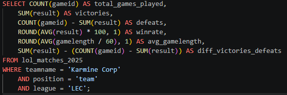

#### Résultat
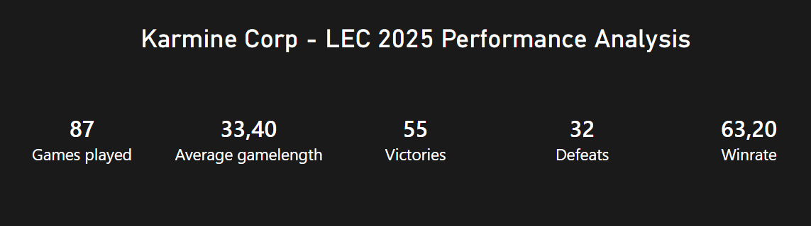

#### Analyse
En 2025, la Karmine Corp a joué 87 parties en LEC dont 55 gagnées et 32 perdues. Autrement dit, la Karmine Corp a un taux de victoire de 63,2 %. Les parties jouées par la Karmine Corp durent en moyenne 33 min et 24 secondes. Cela montre une performance de l'équipe globalement positive. Pour savoir quelles sont les raisons de ces performances, il faudra réaliser une analyse plus détaillée et identifier les facteurs de ces résultats.

### Analyse des joueurs
#### Objectif
Identifier les meilleurs performeurs

#### Méthodologie
Calcul des différentes statistiques pour chaque joueur KC
- kills moyens
- deaths moyens
- assists moyens
- KDA moyen
- or total obtenu en moyenne
- nombre de sbires tués en moyenne
- dégâts moyens

#### Requête SQL
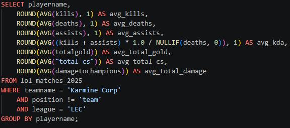

#### Résultat
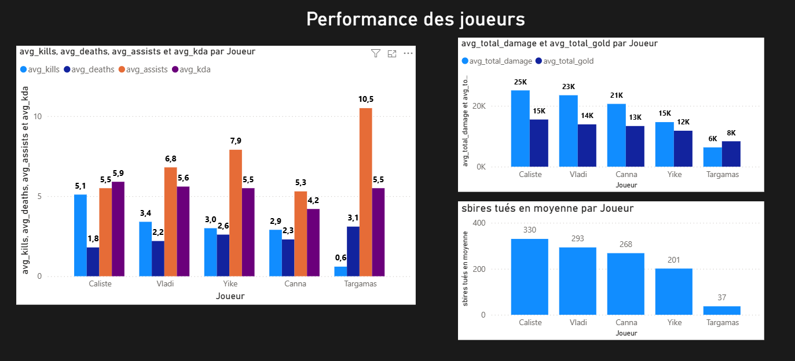

#### Analyse
Dans l'équipe Karmine Corp, le joueur qui prend le plus de ressource est Caliste avec 330 sbires tués en moyenne et 15000 golds obtenus en moyenne. Il est également le joueur ayant le meilleur KDA et celui qui inflige le plus dégât. Cela montre que Caliste joue un rôle important pendant les teamfights. Cependant, Vladi, Yike et Targamas ont un nombre d'assists moyens élevés, ils ne sont donc pas à exclure dans le choix du joueur le plus impliqué dans les combats. Enfin, Canna inflige beaucoup dégâts malgré un kda plus faible dû à son rôle.

### Analyse des victoires
#### Objectif
Comprendre ce qui est associé aux wins.

#### Méthodologie
Comparaison des statistiques de la KC pendant les victoires et les défaites

#### Requête SQL
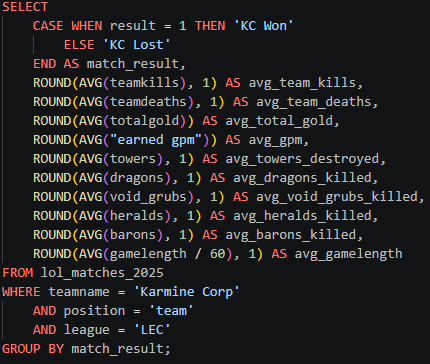

#### Résultat
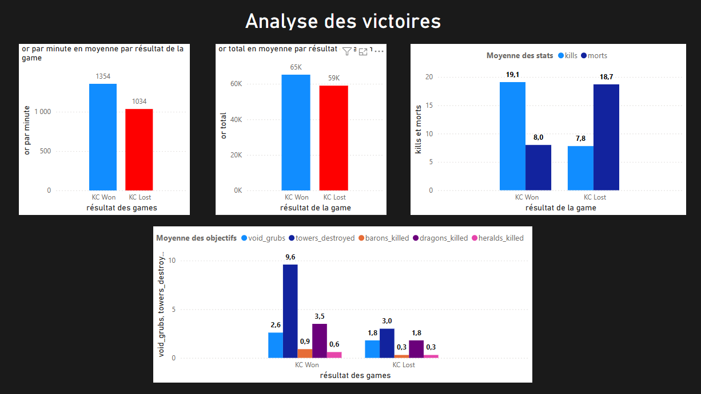

#### Analyse
Les différentes statistiques de la Karmine Corp montrent que lors des victoires, la KC réalise beaucoup plus de kills en moyenne et meurt que très peu de fois. Tandis que lors des défaites de la KC, le résultat est l'exact l'opposé. La KC génère également plus de ressources lors des victoires et parvient à détruire 3x plus de tours que pendant les défaites. Les facteurs ayant le plus d'impact durant ces parties sont le nombre de morts et le nombre d'ennemis tués, les teamfights de la KC sont fortement liés à leurs victoires qui leur permettent de prendre plus ressources et objectifs.

### Analyse par rôle
#### Objectif
Comparer les rôles

#### Méthodologie
Pour chaque rôle, les statistiques calculés sont :
- le KDA moyen
- l'or total obtenu en moyenne
- les dégâts moyens
- la participation aux kills

#### Requête SQL
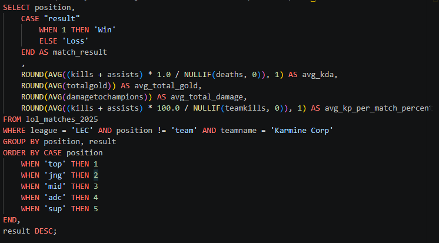

#### Résultat
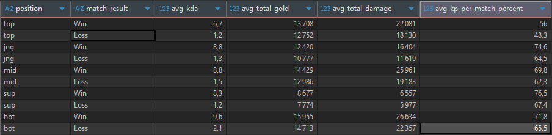

#### Analyse
Les différents indicateurs montrent que les rôles de chaque joueur ont un impact différent dans les parties. Le jungler et le support sont fortement liés aux teamfights comme le montre leur participation aux kills de l'équipe. Le toplaner, midlaner et l'adc lors des teamfights vont infliger le plus dégâts. De plus, le midlaner et l'adc génèrent le plus de ressources lors des victoires. On observe que grâce à ces ressources générés, ces 2 rôles infligent plus de dégâts lors des victoires. Enfin, malgré un kill participation plus faible, le toplaner inflige quand même beaucoup de dégâts. Cela montre son impact notamment sur la phase de lane. 

### Comparaison avec les autres équipes
#### Objectif
Situer KC dans le championnat

#### Méthodologie
Classer la KC en fonction des indicateurs:
- winrate
- kills moyens
- golds moyens
- dégâts moyens
- durée moyenne des parties

#### Requête SQL
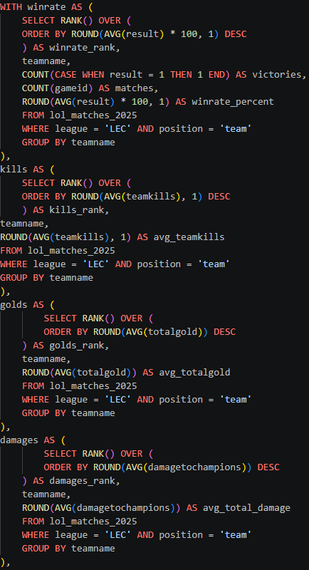 \
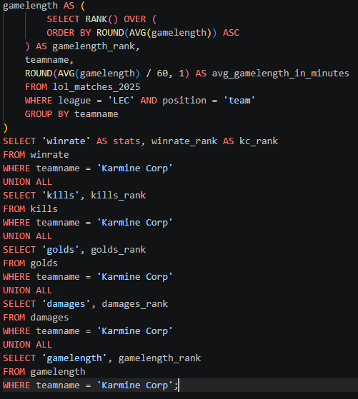

#### Résultat
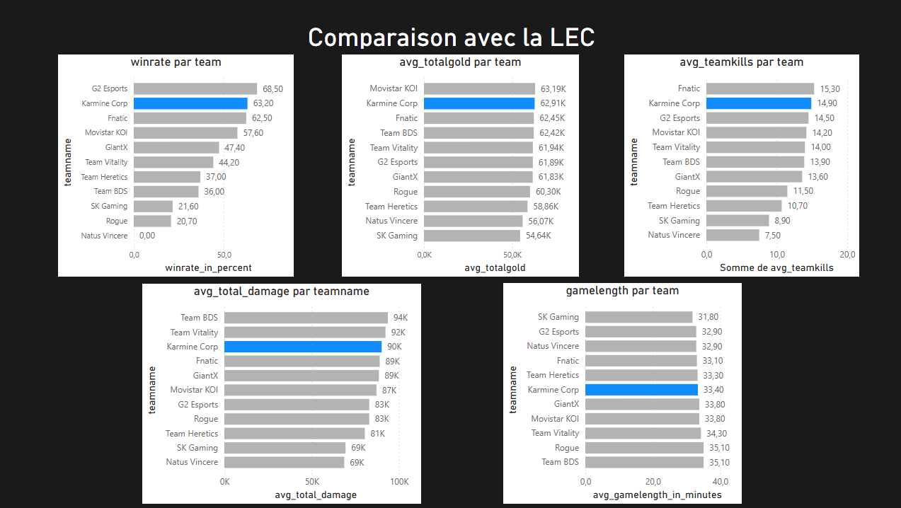

#### Analyse
D'après ces différents classements, la Karmine Corp est une équipe dominante qui se traduit par son winrate, sa capacité à générer des golds et par ses teamfights notamment grâce aux dégâts infligés aux ennemis et par le nombre d'ennemis tués.

### Analyse avancée

#### Quels adversaires posent le plus de problèmes à KC ?

#### Méthodologie
- Calcul du winrate et nombre de victoires/défaites de la KC contre chaque équipe de la LEC 

#### Requête SQL
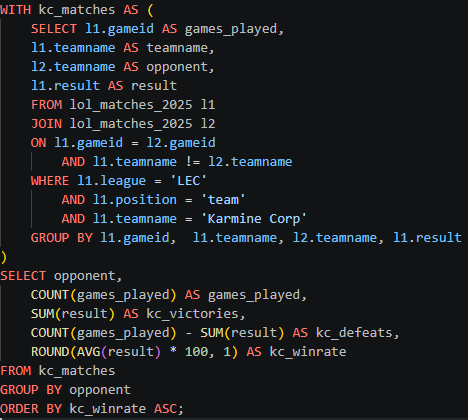

#### Résultat
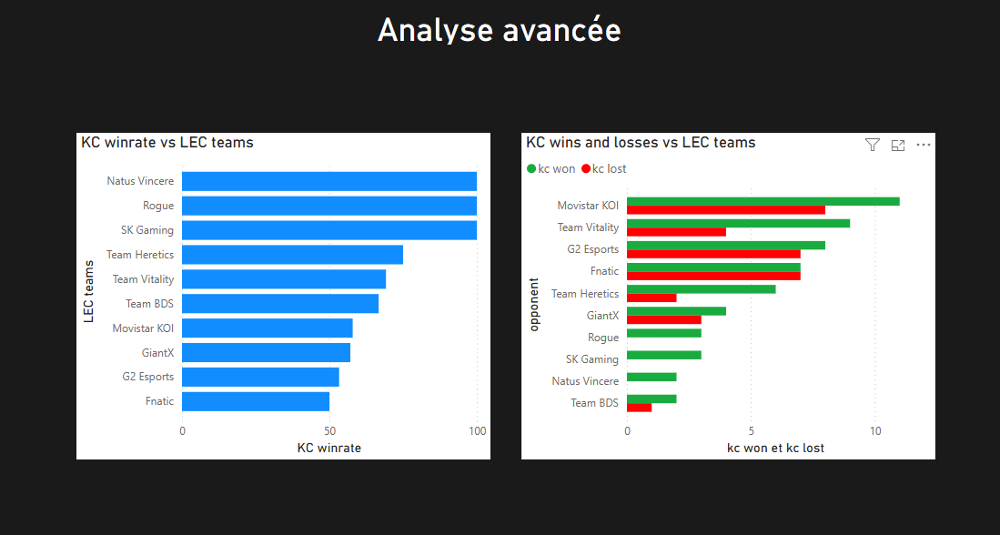

#### Analyse
Les 3 équipes posant le plus de problème à la KC sont fnatic avec un winrate de 50% sur 14 parties jouées, suivi de G2 Esports avec un winrate de 53,3 % sur 15 games. La dernière équipe qui pose le plus problème est Movistar KOI avec un winrate de 57,9% sur 19 games.
En observant le graphique des taux de victoire, on observe que la KC a un taux de victoire plus faible contre GiantX que contre Movistar KOI mais étant donné que la KC a joué plus du double de games contre Movistar KOI. On en déduit que Movistar Koi est une équipe plus résistante que GiantX. 

#### Quel est le joueur qui pose le plus de problème à la Karmine Corp ?

#### Méthodologie
Classement des joueurs en fonction des différents indicateurs : 
- nombres de parties
- KDA moyen
- gold moyen
- dégâts moyes
- kill participation
- global ranking (somme des différents rangs, nombre de parties non inclus)

#### Requête SQL
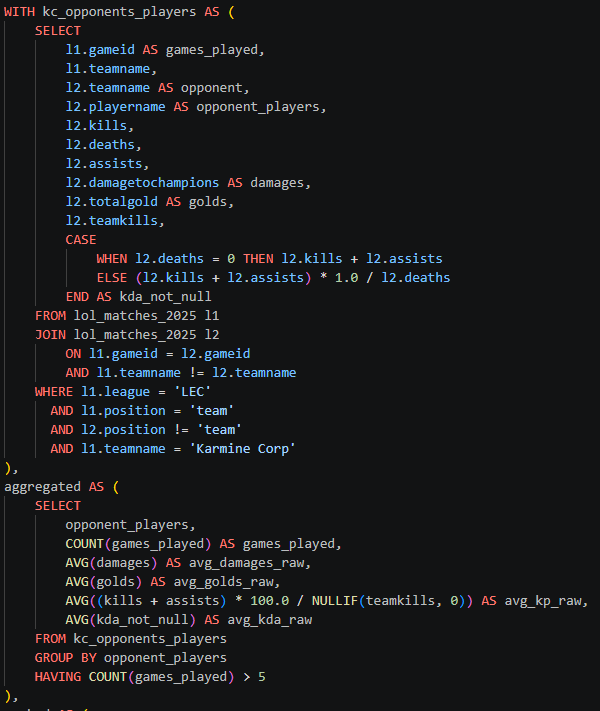 \
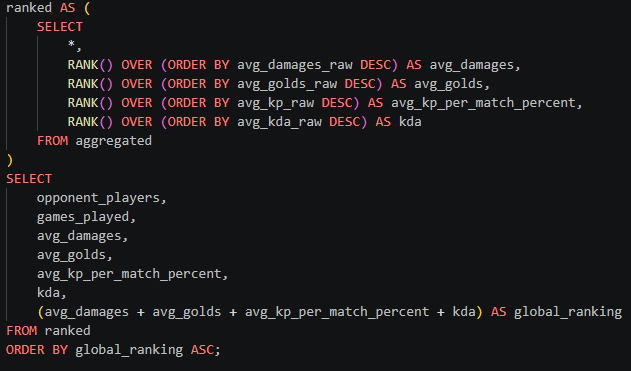

#### Résultat
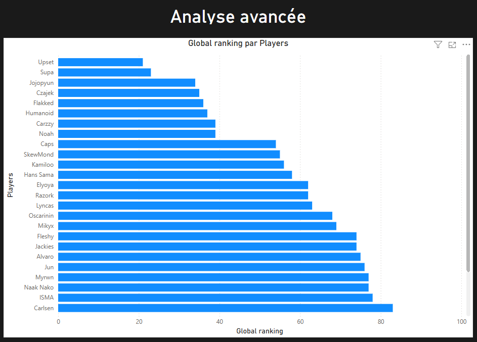

#### Analyse
En calculant le rang des joueurs en fonction des différents indicateurs et en prenant en compte uniquement les joueurs ayant joué plus de 5 parties contre la Karmine Corp, Upset de l'équipe Fnatic est le joueur causant le plus de difficultés à cette dernière.

#### KC gagne-t-elle davantage avec des parties courtes ou longues ?

#### Méthodologie
Tri des parties selon leur durée

#### Requête SQL
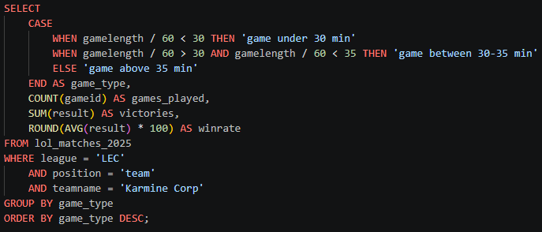

#### Résulat
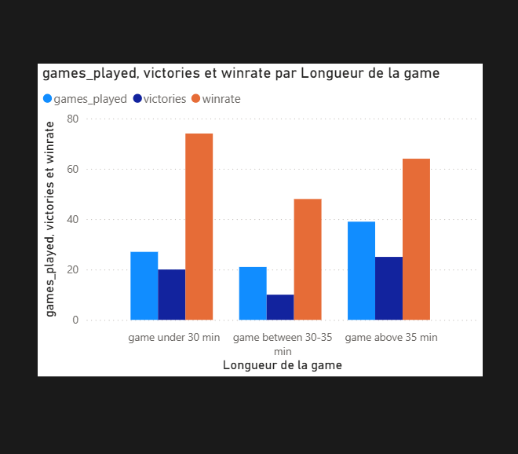

#### Analyse
La majorité des victoires viennent des parties qui durent plus de 35 minutes, cela suggère que les games se terminent après un teamfight au drake ancestral. Cependant, la Karmine Corp a un meilleur taux de victoire lorsque les parties durent moins de 30 minutes. Cela montre que la Karmine Corp lorsqu'elle a un avantage en early game ou en mid game, elle n'a pas de difficultés à terminer.

#### Quels sont les champions les plus joués ?

#### Requête SQL
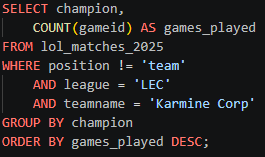

#### Résultat
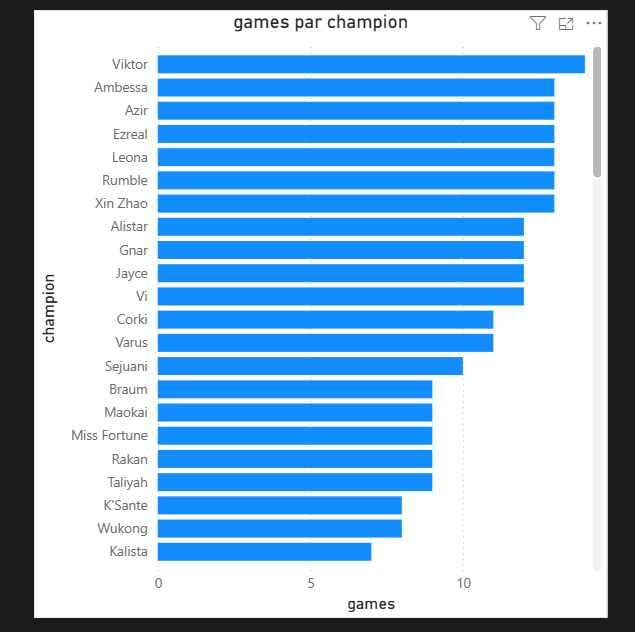

#### Analyse
Les 5 champions les plus joués sont Viktor, Ambessa, Azir, Ezreal et Leona.

#### Quels sont les champions les plus joués par rôle ?

#### Requête SQL
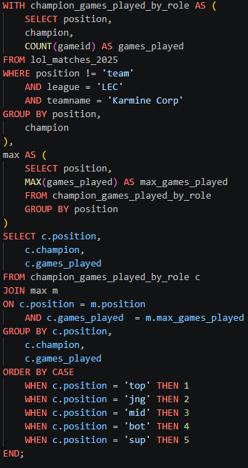

#### Résultat
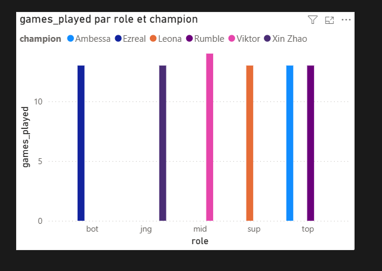

#### Analyse
Les champions les plus joués par rôle:
- Top : Ambessa 80% winrate, Rumble 80% winrate
- Jungle : Xin Zhao 70% winrate
- Mid : Viktor 80% winrate
- Adc : Ezreal 70% winrate
- Support : Leona 60% winrate

## Conclusions

### Forces
- Excellente capacité à teamfight
- La Karmine Corp termine rapidement et gagne plus ses games lorsqu'elle a un avantage en early ou mid game.
- Nombres des objectifs réalisés lors des victoires
- Individualités des joueurs très 
- Winrate globale excellente

### Faiblesses
- Lors des défaites, le nombre de morts de la Karmine Corp est trop élevé
- Moins d'objectifs réalisés à cause des morts

L'analyse sur la performance de la Karmine Corp en LEC de l'année 2025 nous montre que leur point fort est principalement les teamfights. En effet, grâce aux ressources générées par les teamfights ils arrivent à débloquer la map notamment en contrôlant les objectifs par exemple en détruisant plus de tourelles. Et elle arrive à terminer les games rapidement lorsqu'elle domine la partie. Cependant, les défaites de la Karmine Corp sont dûes principalement au nombre de morts qui est trop élevé ce qui impacte également les objectifs.